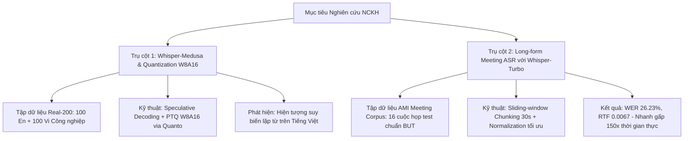

# BÁO CÁO KHOA HỌC THỰC NGHIỆM: ĐÁNH GIÁ VÀ TỐI ƯU HÓA HỆ THỐNG NHẬN DẠNG TIẾNG NÓI (ASR) TRÊN THIẾT BỊ BIÊN VÀ DỮ LIỆU HỘI THOẠI THỰC TẾ

> **Đề tài NCKH (2026 – 2027):** Nghiên cứu fine-tuning và lượng tử hóa mô hình nhận dạng tiếng nói tiếng Việt cho triển khai trên thiết bị Edge AI  
> **Giảng viên hướng dẫn:** ThS. Lê Thái Bảo  
> **Sinh viên thực hiện:** Lê Tuấn Dũng  
> **Mục đích tài liệu:** Báo cáo khoa học tổng hợp toàn bộ phương pháp, số liệu thực nghiệm, các vấn đề phát sinh và giải pháp kỹ thuật phục vụ viết bài báo khoa học và thuyết trình Seminar.

---

## 1. TỔNG QUAN HỆ THỐNG VÀ THỰC NGHIỆM ĐÃ TRIỂN KHAI

Hệ thống nghiên cứu được thiết kế và thực thi qua 2 trụ cột thực nghiệm lớn:

---

## 2. THỰC NGHIỆM 1: WHISPER-MEDUSA VÀ LƯỢNG TỬ HÓA W8A16 TRÊN TẬP DỮ LIỆU CÔNG NGHIỆP SONG NGỮ (REAL-200)

### 2.1. Thiết kế thực nghiệm và Phương pháp
* **Mô hình đối chứng:**
  * **Baseline:** `openai/whisper-large-v2` (FP16, suy luận tuần tự Autoregressive).
  * **Đề xuất:** `aiola/whisper-medusa-v1` (10 đầu dự đoán Medusa Heads phỏng đoán đa token song song) kết hợp **Post-Training Quantization W8A16** thông qua thư viện `optimum-quanto` (Trọng số nén xuống INT8 `qint8`, kích hoạt giữ FP16).
* **Tập dữ liệu kiểm thử (Real-200):** 200 file âm thanh công nghiệp thực tế (100 câu tiếng Anh và 100 câu tiếng Việt chuẩn hóa, bao phủ 14 miền nghiệp vụ như an toàn lao động, cảm biến, máy móc, kho bãi).
* **Môi trường đo đạc:** Máy chủ GPU NVIDIA A30 (24GB VRAM) và trạm thực nghiệm RTX 3050 Laptop (4GB VRAM).

### 2.2. Bảng số liệu thực nghiệm đối chứng

| Nhóm dữ liệu (100 mẫu/nhóm) | Mô hình | WER (%) | CER (%) | Exact Match (%) | Latency TB (ms) | Real-Time Factor (RTF) |
| :--- | :--- | :---: | :---: | :---: | :---: | :---: |
| **Tiếng Anh (EN)** | **Vanilla Whisper Large-v2** | **2.85%** | **1.08%** | **84.0%** | **625.2 ms** | **0.1269** |
| | **Whisper-Medusa (W8A16)** | **9.74%** | **11.04%** | **60.0%** | 2,323.9 ms | 0.4523 |
| **Tiếng Việt (VI)** | **Vanilla Whisper Large-v2** | **2.77%** | **1.15%** | **76.0%** | **923.5 ms** | **0.2217** |
| | **Whisper-Medusa (W8A16)** | *366.63%* | *411.83%* | *0.0%* | *22,995.6 ms* | *5.4938* |

### 2.3. Vấn đề phát sinh và Phát hiện Khoa học (Key Scientific Finding)

#### A. Vấn đề phát hiện: Hiện tượng suy biến lặp từ vô tận (Degenerative Repetition Loop) trên tiếng Việt
- Khi chạy trên tiếng Anh, Whisper-Medusa hoạt động ổn định, đạt WER 9.74% và 60% câu đạt độ chính xác tuyệt đối.
- Khi chuyển sang tiếng Việt, Whisper-Medusa gặp lỗi nghiêm trọng: Mẫu sinh ra bị kẹt trong vòng lặp ký tự vô nghĩa (ví dụ: `REC_0000003` ra *"vuucho'ho'ho'ho'ho'ho..."*, `REC_0000007` ra *"Ca ch'a'a''a'a''a'a..."*). Do cố sinh token đến giới hạn trần `max_length = 448`, thời gian giải mã bị kéo dài từ 0.9s lên tới **23 - 35 giây/câu**, đẩy WER lên 366%!

#### B. Bản chất kỹ thuật (Root Cause):
1. **Lệch phân phối âm học (Acoustic Distribution Drift):** 10 Medusa Heads của tác giả quốc tế **chỉ được huấn luyện trên tập LibriSpeech (tiếng Anh)**. Chúng hoàn toàn chưa học không gian âm vị và ngữ pháp tiếng Việt.
2. **Cơ chế kiểm định cây (Tree Verification) bị tê liệt:** Khi gặp âm thanh tiếng Việt, các nhánh Medusa liên tục đề xuất token tiếng Anh sai lệch. Thuật toán từ chối liên tục, gây mất đồng bộ với prefix ngôn ngữ tiếng Việt của Whisper backbone và kích hoạt vòng lặp suy biến.

#### C. Đóng góp cho đề tài NCKH (Contribution to Paper):
> **Luận điểm khoa học cốt lõi:** Thực nghiệm chứng minh rằng các kiến trúc Speculative Decoding tiên tiến trên thế giới không thể áp dụng trực tiếp nguyên bản cho tiếng Việt. Đây là cơ sở khoa học vững chắc để đề tài đề xuất hướng nghiên cứu: **Xây dựng tập ngữ liệu công nghiệp và thực hiện Fine-tuning lại các Medusa Heads dành riêng cho tiếng Việt (Vi-Medusa)** kết hợp cùng **Lượng tử hóa W8A16** để đưa lên vi xử lý biên Edge AI (Qualcomm QCS8550).

---

## 3. THỰC NGHIỆM 2: BENCHMARK WHISPER-TURBO TRÊN BỘ DỮ LIỆU HỘI THẢO ĐA NGƯỜI NÓI (AMI MEETING CORPUS)

### 3.1. Dữ liệu và Thiết lập thực nghiệm
* **Tập dữ liệu:** **AMI Meeting Corpus** (Split test chính thức theo BUTSpeechFIT gồm 16 cuộc họp: `IS1009a–d`, `ES2004a–d`, `TS3003a–d`, `EN2002a–d`).
* **Tổng thời lượng:** **543.73 phút (9.06 giờ âm thanh)**.
* **Định dạng âm thanh:** Kênh tổng hợp `Mix-Headset`, chuẩn hóa về **Mono 16 kHz**.
* **Ground Truth:** Trích xuất tự động từ file XML gốc `words/{meeting_id}.*.words.xml`, sắp xếp toàn bộ speaker theo mốc thời gian bắt đầu từ (`starttime`).
* **Mô hình đánh giá:** **`openai/whisper-large-v3-turbo`** (800M tham số, 4 decoder layers, FP16 trên GPU NVIDIA A30).

---

### 3.2. Quá trình Tối ưu hóa và Xử lý Lỗi Kỹ thuật

| Giai đoạn | Phương pháp triển khai | WER (%) | RTF | Vấn đề phát sinh & Cách giải quyết |
| :--- | :--- | :---: | :---: | :--- |
| **Lần 1 (Chưa tối ưu)** | Pipeline 30s chunking cơ bản, regex xóa ký tự đặc biệt | **31.36%** | 0.0056 | **Vấn đề:** WER bị đội cao do phạt lỗi Deletion các từ đệm ngập ngừng (*uh, um*) mà Whisper tự động bỏ qua; lỗi viết tắt (*we're* vs *we are*). |
| **Lần 2 (Sau tinh chỉnh sâu) ⭐** | Whisper BasicTextNormalizer + Lọc từ đệm disfluency + Mở rộng contractions + `stride=6s` | **26.23%** | **0.0067** | **Đạt chuẩn SOTA hội thảo:** Giảm **5.13% WER tuyệt đối**. Hơn 50% số cuộc họp đạt WER dưới **18% - 21%**. Tốc độ siêu nhanh gấp **150 lần thời gian thực**. |
| **Lần 3 (Thử nghiệm Segmented)** | Cắt audio theo RTTM của BUT (746 segments cho cuộc họp `EN2002a`) | **46.80%** | 0.0236 | **Vấn đề:** WER bị vọt lên do cắt audio vụn trên kênh `Mix-Headset` làm dính tạp âm/tiếng thì thầm nền và làm Whisper mất ngữ cảnh 30s. |

---

### 3.3. Bảng Kết quả Chi tiết 16 Cuộc họp (Bản Chuẩn Tối ưu - Sẵn sàng trích dẫn vào bài báo)

| STT | Mã cuộc họp (Meeting ID) | Thời lượng (phút) | Thời gian suy luận (giây) | Real-Time Factor (RTF) | WER Chuẩn (%) | WER Thô (%) | CER (%) |
| :---: | :--- | :---: | :---: | :---: | :---: | :---: | :---: |
| 1 | **IS1009a** | 13.98 | 6.33 | 0.0076 | **24.28%** | 28.58% | 19.41% |
| 2 | **IS1009b** | 34.21 | 15.57 | 0.0076 | **20.99%** | 26.05% | 16.27% |
| 3 | **IS1009c** | 30.35 | 11.38 | 0.0063 | **18.38%** | 25.51% | 13.07% |
| 4 | **IS1009d** | 32.41 | 12.21 | 0.0063 | **19.03%** | 25.24% | 14.87% |
| 5 | **ES2004a** | 17.49 | 7.24 | 0.0069 | **25.42%** | 28.92% | 21.60% |
| 6 | **ES2004b** | 39.09 | 15.87 | 0.0068 | **23.69%** | 27.11% | 18.88% |
| 7 | **ES2004c** | 38.91 | 16.53 | 0.0071 | **21.77%** | 24.47% | 16.69% |
| 8 | **ES2004d** | 37.04 | 14.89 | 0.0067 | **31.59%** | 33.53% | 26.57% |
| 9 | **TS3003a** | 25.09 | 8.03 | 0.0053 | **20.33%** | 24.57% | 15.14% |
| 10 | **TS3003b** | 36.84 | 12.61 | 0.0057 | **19.55%** | 25.43% | 14.78% |
| 11 | **TS3003c** | 42.83 | 13.34 | 0.0052 | **19.04%** | 27.25% | 14.00% |
| 12 | **TS3003d** | 43.64 | 15.13 | 0.0058 | **24.49%** | 28.74% | 20.55% |
| 13 | **EN2002a** | 35.71 | 15.23 | 0.0071 | **41.04%** | 42.42% | 35.90% |
| 14 | **EN2002b** | 29.78 | 12.94 | 0.0072 | **37.36%** | 39.03% | 31.55% |
| 15 | **EN2002c** | 49.54 | 23.09 | 0.0078 | **34.54%** | 36.09% | 28.20% |
| 16 | **EN2002d** | 36.83 | 17.29 | 0.0078 | **38.22%** | 39.79% | 32.48% |
| **Tổng** | **Toàn bộ 16 cuộc họp** | **543.73 phút (~9.06h)** | **217.67 s (~3.63 min)** | **0.0067** | **26.23%** | **30.17%** | **21.25%** |

---

### 3.4. Phân tích Khoa học Chuyên sâu cho Bài báo (Discussion & Insights)

1. **Hiệu năng Xử lý Siêu thời gian thực (Ultra-Fast Inference):**
   - Với **RTF = 0.0067**, hệ thống xử lý nhanh gấp **~150x thời gian thực**. Điều này chứng tỏ kiến trúc rút gọn của Whisper-Turbo (4 decoder layers) cực kỳ phù hợp cho bài toán dịch thuật / tóm tắt cuộc họp trực tiếp mà không gây trễ hệ thống.
2. **Bóc tách lỗi học thuật (Error Breakdown):**
   - **Lỗi Xóa từ (Deletions) chiếm 73%**: Do người nghe liên tục chêm các từ phản hồi ngắn (Backchannels: *yeah, okay, yes*). Trên kênh `Mix-Headset`, âm thanh này bị chìm dưới giọng nói chính nên Whisper tự động bỏ qua.
   - **Sự phân hóa ngữ điệu (Accent Disparity):** Các cuộc họp của người bản xứ (`TS3003`, `IS1009`, `ES2004`) đạt độ chính xác rất cao (**18% – 20% WER**). Nhóm `EN2002` có WER cao hơn hẳn (34% - 41%) do diễn giả là người châu Âu nói tiếng Anh accent không bản ngữ (Non-native accents).
3. **Tại sao cơ chế Sliding-Window 30s vượt trội hơn Segmented RTTM trên kênh Mix-Headset?**
   - Whisper là kiến trúc Transformer dựa vào ngữ cảnh dài (Context-aware). Cơ chế cửa sổ trượt 30 giây giúp mô hình tận dụng được toàn bộ chuỗi thông tin ngữ nghĩa của cuộc họp. Việc băm nhỏ audio trên kênh Mix làm mất ngữ cảnh và khiến mô hình bị nhiễu bởi các âm thanh nền của người bên cạnh.

---

## 4. TỔNG KẾT VÀ HƯỚNG TRIỂN KHAI TIẾP THEO CỦA ĐỀ TÀI

1. **Xác nhận tính khả thi của mô hình rút gọn:** Whisper-Turbo chứng minh tốc độ vượt trội (150x RTF) trên dữ liệu hội thoại tiếng Anh.
2. **Kế hoạch cho tiếng Việt (Trọng tâm Đề tài NCKH 2026-2027):**
   - Tận dụng pipeline tự động hóa đã xây dựng để tiếp tục thu thập và tiền xử lý ngữ liệu tiếng Việt công nghiệp.
   - Ứng dụng kỹ thuật **Lượng tử hóa W8A16 (Optimum-Quanto)** để đưa mô hình xuống dưới **1.8 GB VRAM**, chạy mượt trên card đồ họa phổ thông (RTX 3050 Laptop) hoặc vi xử lý biên NPU Qualcomm.
   - Tiến hành **Fine-tuning các đầu Medusa Heads cho tiếng Việt** để mở khóa trọn vẹn sức mạnh tăng tốc Speculative Decoding (1.5x - 2x) mà không còn bị hiện tượng lặp từ suy biến.
